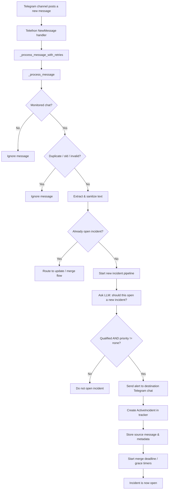
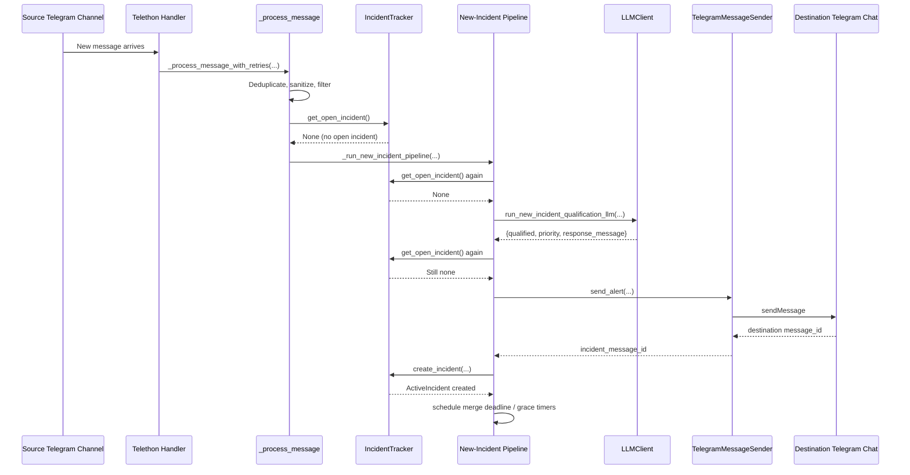
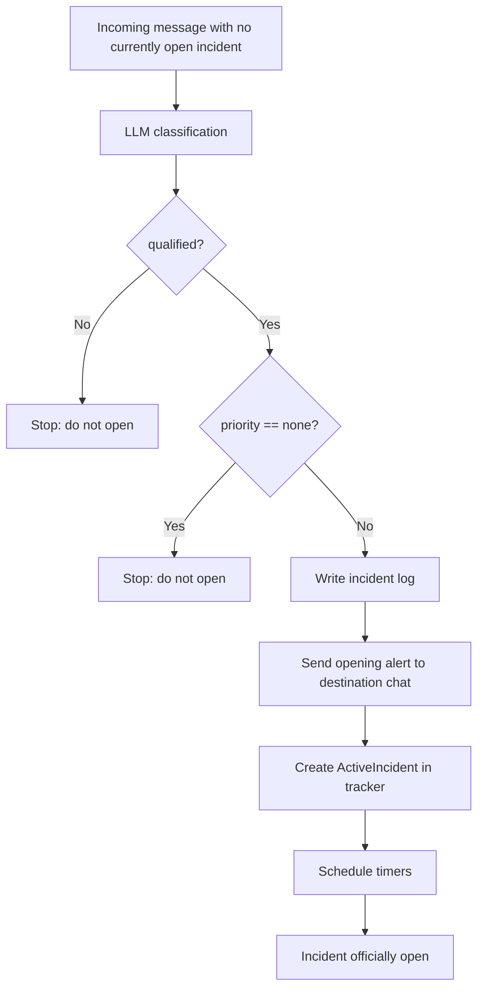

# New Incident Journey — How a message becomes an opened incident

This document explains **only the “new incident opening” path**.  
I mention the “existing incident / merge / update” path only when it helps explain why a _new_ incident is **not** opened.

---

## 1) Big picture

When a new Telegram post arrives, the system asks a simple business question:

> **“Should this message open a brand-new incident for the user?”**

To answer that, the code moves the message through a pipeline:

1. **Listen to incoming Telegram messages**
2. **Ignore duplicates / irrelevant items**
3. **Clean the text**
4. **Check whether an incident is already open**
5. **If not, ask the LLM whether this is a valid new incident**
6. **If yes, send an alert to the destination Telegram chat**
7. **Create and store the incident in memory**
8. **Start timers so the incident can later expire or close automatically**

Main entry points:

- `main.py:1192-1236`
- `main.py:576-691`
- `main.py:775-880`

---

## 2) Visual overview

---

## 3) Step-by-step journey

### Step 1 — The app subscribes to Telegram events

The bot registers Telegram event handlers using **Telethon**.  
For a brand-new message, the `NewMessage` handler calls the message-processing pipeline.

Relevant code:

- `main.py:1192-1236` — registers handlers
- `main.py:1223-1226` — new message handler calls `_process_message_with_retries(...)`

What that means in plain English:

- The system is “listening” to Telegram channels all the time.
- Every new post is pushed into the same central processing flow.

---

### Step 2 — The message enters a retry wrapper

Before doing any business logic, the code runs the message through a retry wrapper:

- `main.py:881-907`

This wrapper exists so that if something temporary fails — for example a network hiccup or a transient API problem — the system retries instead of losing the message immediately.

Plain English:

- The system gives itself a few chances to succeed.
- It uses increasing wait times between retries.

---

### Step 3 — The message is filtered before any “incident thinking” happens

Inside `_process_message(...)`, the code performs several early checks:

- `main.py:584-607` — ignores unmonitored chats and video posts
- `main.py:593-600` — skips old/duplicate new messages using watermarks
- `main.py:608-612` — reads raw text, sanitizes it, drops empty results
- `components/handle_wm.py:16-43` — watermark logic
- `components/utils.py:196-208` — text sanitization

What these checks do:

#### 3.1 Monitored chat check

The bot only processes messages from configured chats:

- `main.py:584-585`
- `main.py:566-575`

#### 3.2 Duplicate protection

For **new messages**, the code uses a channel watermark:

- `main.py:593-600`
- `components/handle_wm.py:16-43`

Meaning:

- If a message ID is older than or equal to the latest processed one for that channel, the system skips it.
- This prevents reopening or reprocessing old material.

#### 3.3 Ignore videos

Messages containing video are skipped:

- `main.py:603-607`

#### 3.4 Sanitize the text

The bot extracts `message.text`, then cleans it with `sanitize_alert_body_text(...)`:

- `main.py:608-612`
- `components/utils.py:196-208`

That sanitizer mainly removes noisy footer-like paragraphs such as promo links or channel handles after a blank line.

Plain English:

- The system tries to keep only the operational text, not channel marketing clutter.

---

### Step 4 — The code asks: “Is there already an open incident?”

This is the critical branching point:

- `main.py:624-689`

Inside the lock, the code reads:

- `opened_incident = self._tracker.get_open_incident()` at `main.py:625`

If an incident already exists:

- the message is prepared for **merge/update** logic (`main.py:656-668`, `main.py:675-676`)

If no incident exists:

- the system gathers a small “recent closure” hint, then proceeds to **new incident opening** (`main.py:669-689`)

The tracker method behind this is:

- `components/Incident/tracker.py:266-277`

Important detail:
`get_open_incident()` does **not** simply return whatever is stored. It first checks whether the current incident:

- is already ended, or
- has expired past its TTL (time-to-live)

If the merge window expired, it can evict the incident automatically:

- `components/Incident/tracker.py:279-308`

Plain English:

- There is only **one active incident slot**.
- If that slot is occupied, the system assumes new incoming text probably belongs to the existing incident.
- If the slot is empty, the message is allowed to try to open a new incident.

---

## 4) The “new incident” pipeline starts

When there is no open incident, the message enters:

- `main.py:775-880` — `_run_new_incident_pipeline(...)`

This function is the heart of opening a new incident.

### Why there is a semaphore here

At the start of this pipeline:

- `main.py:789`

The code uses `self._incident_pipeline_sem = asyncio.Semaphore(1)` (created in `main.py:80`) so only one new-incident opening flow runs at a time.

Plain English:

- This avoids a race where two messages arrive almost together and both try to open separate incidents.

---

## 5) It double-checks whether an incident appeared meanwhile

Inside `_run_new_incident_pipeline(...)`, the code checks **again** whether an incident was opened by another concurrent flow:

- `main.py:790-808`

Then it checks **again after the LLM returns**:

- `main.py:821-842`

This is a classic concurrency-safety pattern.

Plain English:

- Even if the system _thought_ there was no open incident a moment ago, another task may have opened one while the LLM was busy.
- If that happens, this message is rerouted into the existing-incident path instead of opening a duplicate incident.

---

## 6) The LLM decides whether this message qualifies as a new incident

If the slot is still empty, the code asks the LLM to classify the message:

- `main.py:810-819`
- `components/Incident/handler.py:769-791`
- `components/llm/llm_client.py:142-182`

The new-incident request is initiated here:

- `components/Incident/handler.py:785-791`

Since `incident=None`, the LLM client chooses the **first/new incident prompt**:

- `components/llm/llm_client.py:161-169`

That prompt is defined in:

- `components/llm/prompts.py:34-58`

### What the LLM is being asked

For a new incident, the LLM must return JSON with:

- `response_message`
- `qualified`
- `priority`

See:

- `components/llm/prompts.py:38-39`
- `components/llm/llm_client.py:25-45`

### What “qualified” means here

The prompt says that a message can qualify when it refers to things like:

- missile / rocket / UAV launches
- preparations for launch

But that is **not enough by itself**.

The prompt also contains many **disqualifiers**, such as:

- news reports / journalist-style summaries
- past-event reports
- all-clear messages
- situations explicitly outside the subscriber’s relevant geography
- broad recaps instead of an actionable live alert

See:

- `components/llm/prompts.py:13-26`
- `components/llm/prompts.py:43-57`

### Priority levels

The LLM also assigns a priority:

- `high`
- `warning`
- `informational`
- `none`

See:

- `components/llm/prompts.py:6-12`

Plain English:

- The LLM is not being asked “summarize this nicely.”
- It is being asked to make a structured operational decision:
  - **Is this a real new incident?**
  - **How important is it?**
  - **What should the user-facing alert text say?**

---

## 7) If the LLM says “no”, the incident is not opened

The final gate is in:

- `components/Incident/handler.py:806-819`

A new incident is rejected if:

- there is already an open incident
- the response is missing
- `qualified == false`
- `priority == none`

If any of those happens, the function returns `None`, and no incident is created.

Plain English:

- The system is deliberately conservative.
- A message must pass both tests:
  1. **qualified**
  2. **priority not none**

---

## 8) If the LLM says “yes”, the system writes an incident log entry

Once the LLM approves opening, the code creates a log suffix and writes a log record:

- `components/Incident/handler.py:821-833`
- `components/Incident/log.py:12-20`
- `components/Incident/log.py:23-85`

What gets logged:

- source channel name
- message ID
- raw message text
- timestamp
- LLM response
- event type

Plain English:

- The system keeps an audit trail of why the incident was opened.

---

## 9) The system builds the first alert text

The opening alert text is prepared here:

- `components/Incident/handler.py:835-847`

Logic:

- If the LLM produced `response_message`, that becomes the initial alert text.
- Otherwise, it falls back to the sanitized source text.

Then:

- `first_seg = sanitize_alert_body_text(text) or initial_text`
- `components/Incident/handler.py:847`

This first segment is important because the system keeps a timeline-like body for later presentation.

---

## 10) The system sends the opening alert to the destination Telegram chat

This is the actual outward-facing “incident opened” moment:

- `components/Incident/handler.py:848-858`
- `components/messages.py:305-351`

The alert is sent with:

- channel name(s)
- unified text
- start time
- priority
- subject (`None` on initial open in this code)
- alert body segments

### How the Telegram message is built

The outbound HTML format is constructed in:

- `components/messages.py:76-157`

It includes:

- a title based on priority (`🚨`, `⚠️`, `ℹ️`)
- channel/source block
- start timestamp
- body text

Priority title mapping lives in:

- `components/constants.py:50-59`
- `components/constants.py:84-92`

Plain English:

- This is the moment the user actually sees the new incident in the destination chat.

---

## 11) The tracker creates the official in-memory incident

After the alert is successfully sent, the system records the newly opened incident in the tracker:

- `components/Incident/handler.py:859-875`
- `components/Incident/tracker.py:316-360`

This creates an `ActiveIncident` object containing:

- a generated `incident_id`
- the destination Telegram `incident_message_id`
- the current unified text
- source channels
- start time
- expiry time
- current priority
- log file suffix
- stored source messages
- alert body timeline segments

See data structure:

- `components/Incident/tracker.py:27-40`

### Important technical point: there is only one open incident

The tracker stores the open incident in:

- `self._current_incident`
- `components/Incident/tracker.py:64-67`

Plain English:

- Opening the incident means placing it into the app’s single “active incident slot”.
- From now on, later incoming messages will usually be treated as updates to this incident rather than as candidates to open another one.

---

## 12) The first source message is stored as authoritative evidence

When the tracker creates the incident, it immediately saves the source message that caused the opening:

- `components/Incident/tracker.py:352-359`

The stored source message includes:

- channel ID and name
- Telegram message ID
- raw text
- sanitized text
- timestamp

Structure:

- `components/Incident/tracker.py:43-50`

Why that matters:

- later edits/deletions/merges can refer back to the exact original source line
- the system can rebuild or correct the incident later using the real source history

---

## 13) The system clears recent-closure memory

Once a fresh incident is opened, the tracker clears the “recently closed incident” hint:

- `components/Incident/handler.py:872`
- `components/Incident/tracker.py:227-228`

Why this exists:
A just-closed incident can leave behind context used to avoid reopening the exact same thread too quickly:

- `components/Incident/tracker.py:230-264`

Plain English:

- Before opening, the system may be skeptical if something was _just_ closed from the same source.
- After it truly opens a new incident, that skepticism is cleared.

---

## 14) The system starts the time logic for the open incident

When a new incident is committed, the function returns the incident’s merge deadline:

- `components/Incident/handler.py:881`

Back in `main.py`, that deadline is used here:

- `main.py:876-877`

Which calls:

- `main.py:375-383` — `_schedule_merge_deadline(...)`

### What this timer means

The incident has a time-to-live:

- `components/constants.py:12` — `ACTIVE_INCIDENT_TTL = timedelta(hours=3)`

When the deadline fires, the code can auto-evict / auto-finalize the incident:

- `main.py:385-454`
- `components/Incident/tracker.py:279-308`

Plain English:

- A newly opened incident does not stay open forever.
- If nothing else closes it first, the merge window eventually expires.

---

## 15) Special case: informational incidents get a grace-close timer immediately

If the LLM opened the incident with low severity (`informational` or `none` display-style opening path), the code schedules an additional short grace timer:

- `components/Incident/handler.py:876-880`
- `components/constants.py:18` — `INFORMATIONAL_GRACE_PERIOD = timedelta(minutes=5)`
- `main.py:364-373`
- `main.py:455-558`

Plain English:

- Lower-severity incidents are allowed to exist briefly,
- but if they do not escalate, the system can close them automatically after a short wait.

This is not part of “opening” itself, but it is attached immediately after a successful open.

---

## 16) Visual: detailed opening sequence

---

## 17) Visual: the decision gate

---

## 18) What data exists immediately after opening?

Right after a new incident opens, the system already has:

- **A Telegram alert visible to users**  
  `components/Incident/handler.py:848-858`, `components/messages.py:305-351`

- **A persisted log entry**  
  `components/Incident/handler.py:821-833`, `components/Incident/log.py:23-85`

- **An in-memory ActiveIncident object**  
  `components/Incident/tracker.py:27-40`, `components/Incident/tracker.py:316-360`

- **The original source message saved as evidence/context**  
  `components/Incident/tracker.py:352-359`

- **A merge deadline / TTL timer**  
  `main.py:375-383`, `components/constants.py:12`

- **Possibly an informational grace timer**  
  `components/Incident/handler.py:876-880`, `components/constants.py:18`

---

## 19) The shortest possible explanation

If I compress the whole journey into one sentence:

> A new Telegram post is filtered, cleaned, checked against the current incident slot, classified by the LLM as either a real new alert or not, and—if approved—sent to the destination chat and stored as the system’s single active incident.

---

## 20) Key references by responsibility

### Event intake

- `main.py:1192-1236`
- `main.py:576-691`

### Dedup / filtering / sanitizing

- `main.py:584-612`
- `components/handle_wm.py:16-43`
- `components/utils.py:196-208`

### New incident pipeline

- `main.py:775-880`

### LLM qualification for opening

- `components/Incident/handler.py:769-791`
- `components/llm/llm_client.py:142-182`
- `components/llm/prompts.py:34-58`

### Commit/open incident

- `components/Incident/handler.py:793-881`

### Incident state storage

- `components/Incident/tracker.py:27-40`
- `components/Incident/tracker.py:316-360`

### Sending the Telegram alert

- `components/messages.py:76-157`
- `components/messages.py:305-351`

### Logging

- `components/Incident/log.py:12-20`
- `components/Incident/log.py:23-85`

### Timers / lifecycle started after opening

- `main.py:375-383`
- `main.py:385-454`
- `main.py:364-373`
- `main.py:455-558`
- `components/constants.py:12`
- `components/constants.py:18`

---

## 21) One subtle but important design choice

The code does **not** open an incident the instant a Telegram post arrives.

Instead, it opens only after all of these are true:

1. the post is not duplicate/noise,
2. there is no currently open incident,
3. the LLM says it is operationally relevant,
4. the LLM assigns a real priority,
5. the alert is successfully sent,
6. the tracker stores the active incident.

That makes the system cautious and stateful rather than reactive in a naive way.
